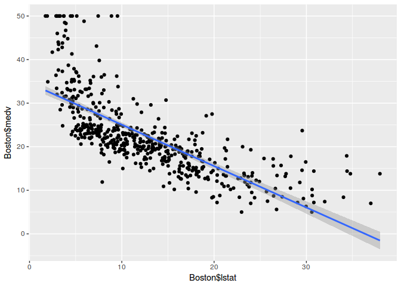
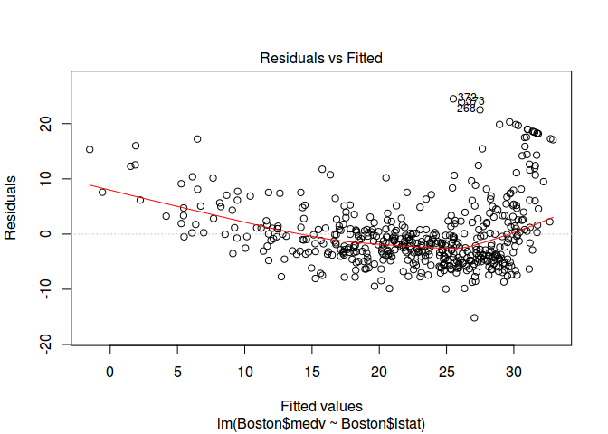
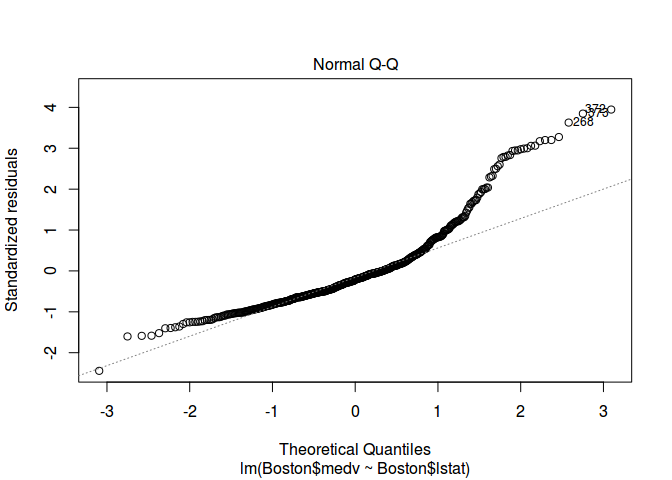
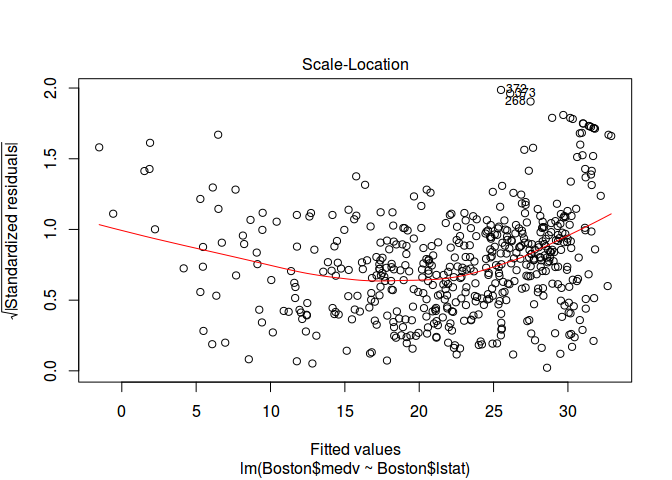
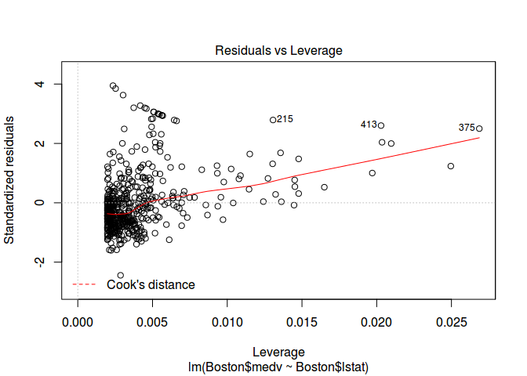
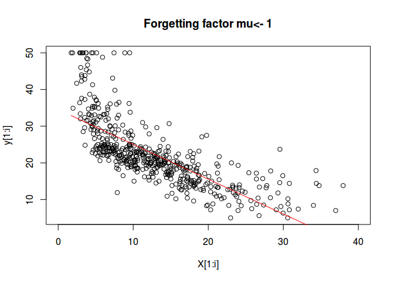

# RecursiveRegression
`r format(Sys.Date())`  


##Exemplo de Regressão Simples

```r
lm_fit <- lm(Boston$medv~Boston$lstat)
summary(lm_fit)
```

```
## 
## Call:
## lm(formula = Boston$medv ~ Boston$lstat)
## 
## Residuals:
##     Min      1Q  Median      3Q     Max 
## -15.168  -3.990  -1.318   2.034  24.500 
## 
## Coefficients:
##              Estimate Std. Error t value Pr(>|t|)    
## (Intercept)  34.55384    0.56263   61.41   <2e-16 ***
## Boston$lstat -0.95005    0.03873  -24.53   <2e-16 ***
## ---
## Signif. codes:  0 '***' 0.001 '**' 0.01 '*' 0.05 '.' 0.1 ' ' 1
## 
## Residual standard error: 6.216 on 504 degrees of freedom
## Multiple R-squared:  0.5441,	Adjusted R-squared:  0.5432 
## F-statistic: 601.6 on 1 and 504 DF,  p-value: < 2.2e-16
```

```r
graph <- ggplot(Boston, aes(y=Boston$medv, x=Boston$lstat)) + geom_point() 
graph + stat_smooth(method = "lm", formula = y ~ x, size = 1)
```

<!-- -->

```r
plot(lm_fit)
```

<!-- --><!-- --><!-- --><!-- -->

##Exemplo de Regressão Simples Recursiva

```r
par(ask=FALSE)
n<-1
X<- matrix(Boston$lstat)
N<-length(X)
y<-matrix(Boston$medv)
t<-numeric(2)
P<-500*diag(n+1)
mu<-1
for (i in 1:N){
  rls.step<-rls(c(1, X[i]),y[i],t,P,mu)
  t<-rls.step[[1]]
  P<-rls.step[[2]]
  if(i == N){
  plot(X[1:i],y[1:i],
       xlim=c(0,40),
       ylim=c(5,50),
       main=paste("Forgetting factor mu<-",mu))
  lines(X[1:i],cbind(array(1,c(i,1)), X[1:i])%*%t,
        col="red",
  )
  }
}
```

<!-- -->

```r
t
```

```
##            [,1]
## [1,] 34.5532737
## [2,] -0.9500153
```

##multivariate linear regression

```r
lm_fit_multi <- lm(Boston$medv~Boston$lstat + Boston$rm)
summary(lm_fit_multi)
```

```
## 
## Call:
## lm(formula = Boston$medv ~ Boston$lstat + Boston$rm)
## 
## Residuals:
##     Min      1Q  Median      3Q     Max 
## -18.076  -3.516  -1.010   1.909  28.131 
## 
## Coefficients:
##              Estimate Std. Error t value Pr(>|t|)    
## (Intercept)  -1.35827    3.17283  -0.428    0.669    
## Boston$lstat -0.64236    0.04373 -14.689   <2e-16 ***
## Boston$rm     5.09479    0.44447  11.463   <2e-16 ***
## ---
## Signif. codes:  0 '***' 0.001 '**' 0.01 '*' 0.05 '.' 0.1 ' ' 1
## 
## Residual standard error: 5.54 on 503 degrees of freedom
## Multiple R-squared:  0.6386,	Adjusted R-squared:  0.6371 
## F-statistic: 444.3 on 2 and 503 DF,  p-value: < 2.2e-16
```

```r
plot(lm_fit)
```

<!-- --><!-- --><!-- --><!-- -->

```r
anova(lm_fit,lm_fit_multi)
```

```
## Analysis of Variance Table
## 
## Model 1: Boston$medv ~ Boston$lstat
## Model 2: Boston$medv ~ Boston$lstat + Boston$rm
##   Res.Df   RSS Df Sum of Sq      F    Pr(>F)    
## 1    504 19472                                  
## 2    503 15439  1    4033.1 131.39 < 2.2e-16 ***
## ---
## Signif. codes:  0 '***' 0.001 '**' 0.01 '*' 0.05 '.' 0.1 ' ' 1
```


```r
source("recursiveRegression.R")
par(ask=FALSE)
n<-1
X<- cbind(Boston$lstat,Boston$rm)
N<-dim(X)[1]
y<-matrix(Boston$medv)
t<-numeric(3)
P<-500*diag(n+2)
mu<-1
for (i in 1:N){
  rls.step<-rls(c(1, X[i,]),y[i],t,P,mu)
  t<-rls.step[[1]]
  P<-rls.step[[2]]
}
t
```

```
##           [,1]
## [1,] -1.356925
## [2,] -0.642371
## [3,]  5.094600
```

